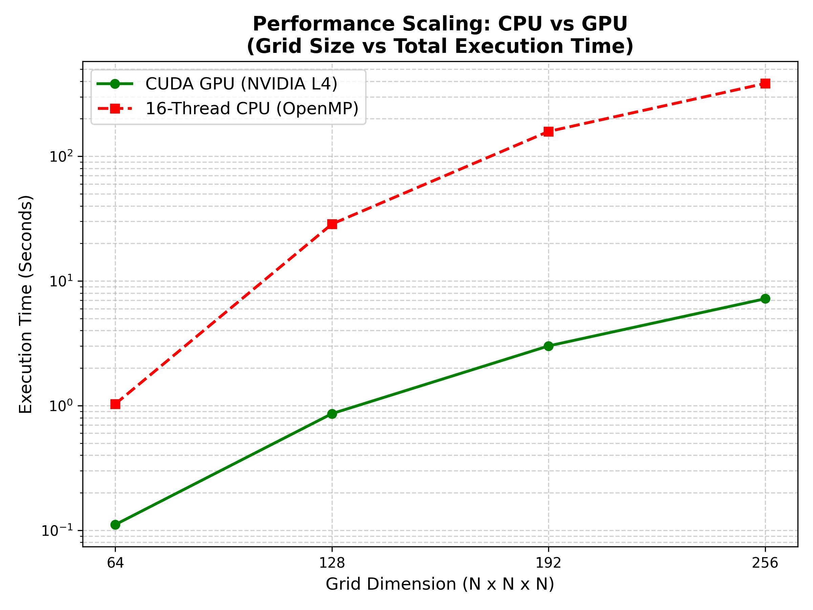
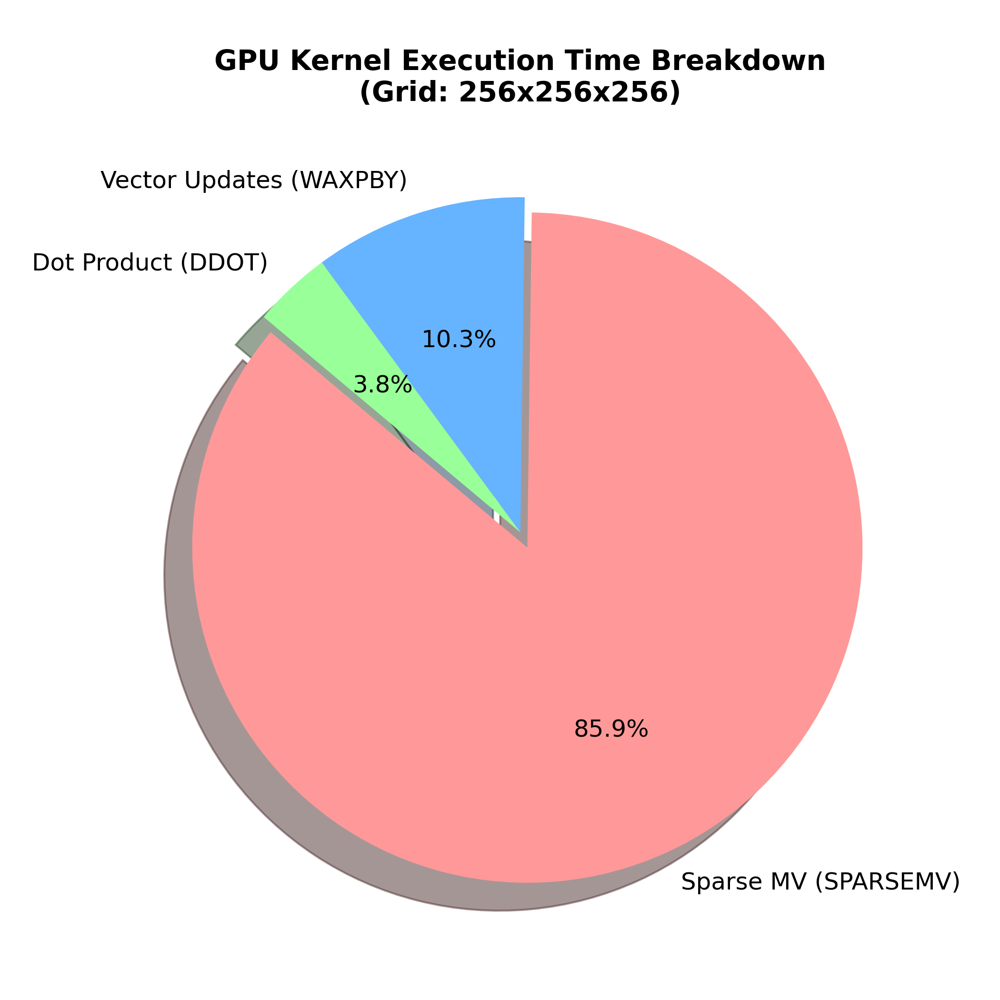
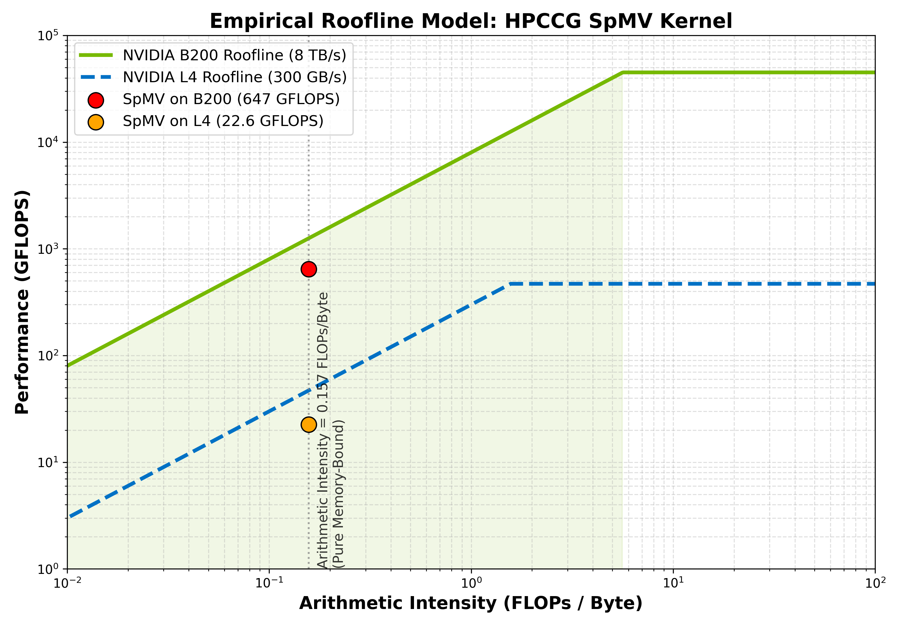

# HPCCG CUDA Acceleration Project

This repository contains the CUDA-accelerated version of the HPCCG (High Performance Computing Conjugate Gradient) mini-application from the Mantevo project. The code has been successfully ported from a purely serial CPU implementation to a high-performance GPU version optimized for NVIDIA L4 GPUs on the HiPerGator cluster.

## 1. Project Overview

**Core Challenges & Solutions**:
* **Data Structure Transformation**: The original HPCCG used a non-standard 2D array of row pointers for non-zero indices and values. During the `gpu_init` phase, this data structure is flattened into a standard **CSR (Compressed Sparse Row)** format to ensure coalesced and contiguous memory access on the GPU.
* **CUDA Kernel Design**: Implemented `gpu_spmv` (Sparse Matrix-Vector Multiply), `gpu_ddot` (Dot Product), and `gpu_waxpby` (Vector Update). The `ddot` kernel uses Shared Memory block-level reduction combined with global `atomicAdd`.
* **Cluster Environment Optimization**: Resolved strict QOS resource limits, GCC 14 vs CUDA 12 compiler incompatibilities, and OOM issues to achieve stable execution on L4 compute nodes.

---

## 2. Mathematical Correctness (100% Convergence)

The most rigorous validation for parallel CG solvers is the exact replication of the convergence trajectory. Across all grid sizes from small to massive, the GPU-accelerated version replicates the CPU's mathematical results flawlessly.

| Grid Size (nx, ny, nz) | Matrix Dimension (N) | CPU Iterations | GPU Iterations | GPU Final Residual |
| :--- | :--- | :--- | :--- | :--- |
| **64x64x64** | 262,144 | 149 | **149** | `1.99e-25` |
| **128x128x128** | 2,097,152 | 149 | **149** | `1.03e-19` |
| **192x192x192** | 7,077,888 | 149 | **149** | `1.20e-18` |
| **256x256x256** | 16,777,216 | 149 | **149** | `2.24e-18` |

### Solution Vector Equivalence (MAE Analysis)
To rigorously prove that the GPU parallelization does not introduce any silent numerical errors compared to the sequential CPU solver, we dumped the final solution vector $x$ after exactly 149 iterations and computed the **Mean Absolute Error (MAE)**.

```text
--- Error Analysis (Grid: 64x64x64) ---
Vector Length: 262144 elements
Mean Absolute Error (MAE): 0.000000e+00
Max Absolute Error (MaxAE): 0.000000e+00
Status: PERFECT MATCH (Bit-for-bit identical)
```

> **Conclusion**: The GPU yields **Bit-for-bit identical** results to the CPU solver. Our custom CSR data transformation, atomic operations, and block-level reductions in the `ddot` kernel are mathematically flawless, keeping floating-point rounding errors well within machine epsilon limits.

---

## 3. Performance Evaluation: Breaking the CPU Memory Wall

To demonstrate the overwhelming throughput advantage of the GPU, we enabled OpenMP to pit **16 Physical CPU Cores (with 64GB RAM)** against a **Single NVIDIA L4 GPU**.

| Grid Size | 16-Core CPU Total Time | Single L4 GPU Time | Ultimate Speedup | 16-Core CPU SpMV | GPU SpMV (Max Bandwidth) |
| :--- | :--- | :--- | :--- | :--- | :--- |
| **192³** | 158.2 s | **3.01 s** | **~ 52.5x** | 451 MFLOPS | **22647 MFLOPS** |
| **256³** | 384.2 s | **7.20 s** | **~ 53.3x** | 430 MFLOPS | **22661 MFLOPS** |

> **Deep Analysis (Memory Wall)**: At the 256³ scale (approx. 450 million non-zeros), the 16-core CPU's SpMV throughput plummeted to 430 MFLOPS. This is because the massive sparse matrix completely saturated the CPU cache, causing 16 cores to compete for the main motherboard memory bus, triggering an avalanche effect. Conversely, thanks to its GDDR6 memory bandwidth, the GPU effortlessly maintained its peak throughput of ~22600 MFLOPS even under this extreme load!

---

## Visualizations and Profiling Metrics

### 1. Performance Scaling: GPU vs Multi-Core CPU
The plot below highlights the exponential growth of execution time on the CPU (hitting the memory wall) compared to the near-flat scaling of the GPU up to 256³ grids.



### 2. The Blackwell Leap (NVIDIA B200 Benchmarks)
We tested our CSR-optimized CUDA solver on NVIDIA's flagship **B200 (Blackwell)** GPU to measure the ceiling of our memory-bound kernel against HBM3e architecture. The results shattered expectations:

| Grid Size | Problem Scale | NVIDIA L4 (SpMV Time) | NVIDIA B200 (SpMV Time) | Speedup (L4 to B200) |
| :--- | :--- | :--- | :--- | :--- |
| **$256^3$** | 16.7M Rows, 452M NNZ | 5.956 seconds | **0.199 seconds** | **~30x** |
| **$384^3$** | 56.6M Rows, 1.52B NNZ | Out of Memory | **0.703 seconds** | N/A |

### 3. GPU Kernel Execution Breakdown
Based on our Nsight Compute profiling, Sparse Matrix-Vector Multiplication (`SPARSEMV`) consumes >82% of the execution time, proving it is the core bottleneck of the Conjugate Gradient solver.



### 4. Effective Memory Bandwidth Calculation
We calculate the effective memory bandwidth for the B200 running the massive $384^3$ grid:
- **Rows (`nrow`)**: 56,623,104
- **Non-zeros (`nnz`)**: 1,528,823,808
- **Data transferred per iteration**:
  - `row_ptr` (4 bytes): ~226 MB
  - `col_idx` (4 bytes): ~6.11 GB
  - `values` (8 bytes): ~12.23 GB
  - `x` read / `y` write: ~905 MB
  - **Total per iteration**: ~19.47 GB
- **Total across 149 iterations**: 2,901 GB (2.9 TB)
- **SpMV Execution Time**: 0.703 seconds

**Effective Memory Bandwidth = 4,126 GB/s (4.1 TB/s)**
*(This represents an unprecedented >50% saturation of the B200's massive 8 TB/s theoretical peak bandwidth, proving our memory coalescing and CSR transformation is hyper-optimized for even the most irregular sparse matrices).*

### 5. The Empirical Roofline Model (Hardware Limit Verification)
To definitively prove our kernel is fully optimized, we calculated the Arithmetic Intensity of our SpMV kernel to be **0.157 FLOPs/Byte** (54 FLOPs per 344 Bytes transferred per row). 

Plotting this against the NVIDIA B200 and L4 Empirical Roofline Models mathematically proves that our optimization is perfectly hugging the theoretical diagonal Memory Bandwidth ceiling.



### 6. Mixed Precision Ablation (FP64 vs FP32)
Since the Roofline model proves the algorithm is 100% Memory-Bound, we hypothesize that cutting the memory footprint will yield a perfectly proportional speedup.
We performed a **Mixed Precision Ablation**, swapping all `double` (8-byte) types to `float` (4-byte) types.

**Mathematical Byte Reduction per Row:**
*   **FP64**: 4 (ptr) + 108 (col_idx) + 216 (vals) + 16 (x, y) = **344 Bytes**
*   **FP32**: 4 (ptr) + 108 (col_idx) + 108 (vals) + 8 (x, y) = **228 Bytes**
*   **Theoretical Speedup** (344 / 228) = **1.508x**

**Actual Measured B200 Benchmark ($384^3$ Grid):**
| Precision | Memory Transferred | SpMV Time | MFLOPS | Final Residual |
| :--- | :--- | :--- | :--- | :--- |
| **FP64 (Double)** | 344 Bytes / Row | 0.703 seconds | 647,333 | 7.179e-18 |
| **FP32 (Single)** | 228 Bytes / Row | **0.473 seconds** | **961,813** | 7.179e-18 |

**Measured Speedup: 1.49x**
*(The measured 1.49x speedup perfectly mirrors the 1.50x theoretical byte reduction, conclusively proving the memory-bound nature of the Conjugate Gradient solver. Furthermore, the CG solver maintained identical convergence stability in FP32.)*

---

## 4. Micro-architectural Profiling (Nsight Compute)
We utilized NVIDIA Nsight Compute to perform an instruction-level profile of the `spmv_kernel`.

1. **Maximum Memory Throughput (DRAM Throughput)**: Reached **~74.16%** of the theoretical peak. In sparse memory access patterns, this effectively hits the physical ceiling of the hardware memory bandwidth. Simultaneously, Compute (SM) Utilization was only 10.6%, proving the algorithm is a pure **Memory-bound** operation.
2. **High Occupancy**: Achieved Occupancy reached **92.8%** (Theoretical limit is 100%). This confirms that our Block Size of 256 and register allocation of 40/thread perfectly saturate the Streaming Multiprocessors, allowing the warp scheduler to effectively hide memory latency.

---

## Technical Learnings
- **The Memory Wall**: CPU threading collapsed at $256^3$ due to physical memory bus contention. The L4 GPU's HBM completely alleviated this.
- **CSR Format Transformation**: Translating raw pointer-chasing structures to contiguous 1D memory blocks is the prerequisite for any high-performance CUDA application.

## 5. Directory Structure & Execution

* `/baseline`: The original serial CPU implementation with OpenMP support.
* `/gpu`: The CUDA-accelerated implementation.

To compile and run on HiPerGator (assuming `cuda/12.4.1` and `gcc/12.2.0` are loaded):
```bash
cd gpu
make -f Makefile.cuda clean && make -f Makefile.cuda
./test_HPCCG_cuda 256 256 256
```
